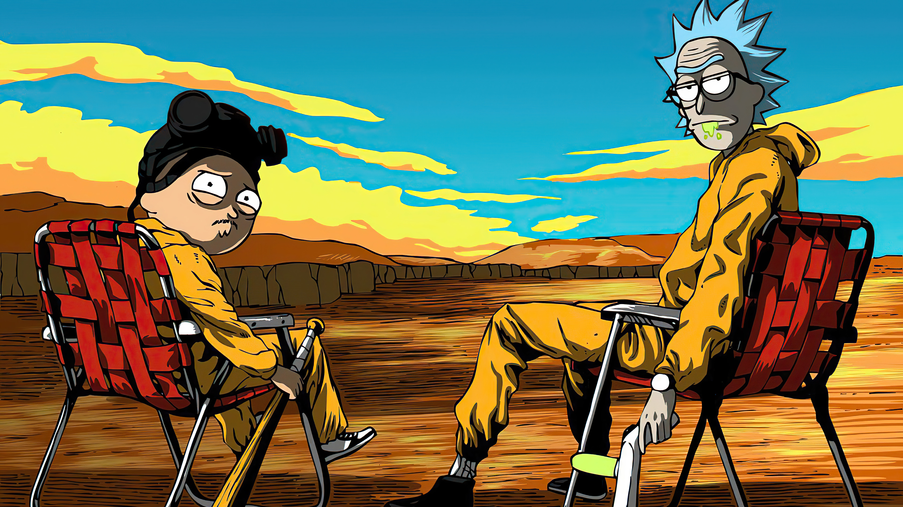

# Projeto Rick and Morty

Bem-vindo ao meu aplicativo web de personagens do Rick and Morty! Se você gosta de aventuras interdimensionais, você está no lugar certo. 🛸



## 📜 Visão Geral

Este projeto é um site temático do universo "Rick and Morty". Aqui, você encontrará uma lista de personagens, um recurso de busca e opção de navegar para os detalhes.

## 🧪 Tecnologias

Este projeto é construído com as seguintes tecnologias:

- HTML
- CSS
- JavaScript
- Node.js
- Express
- Axios
- Bootstrap

## 📁 Estrutura do Projeto

Aqui está a estrutura de diretório do projeto:

```
public
├── index.html
├── style.css
├── script.js
├── character.html
server.js
package.json
package-lock.json
```


## 🚀 Instruções para Executar

1. Tenha o Node.js instalado na sua máquina.

2. Clone o repositório.

3. Navegue até o diretório do projeto no terminal.

4. Execute o seguinte comando para instalar as dependências:

```bash
npm install
```

5. Inicie o servidor:

```
node server.js
```


6. Acesse o site em [http://localhost:3000](http://localhost:3000) no seu navegador.
